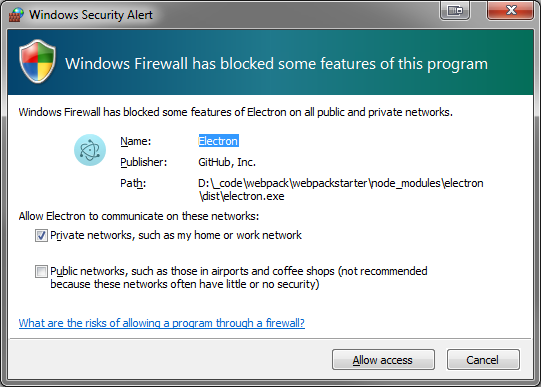
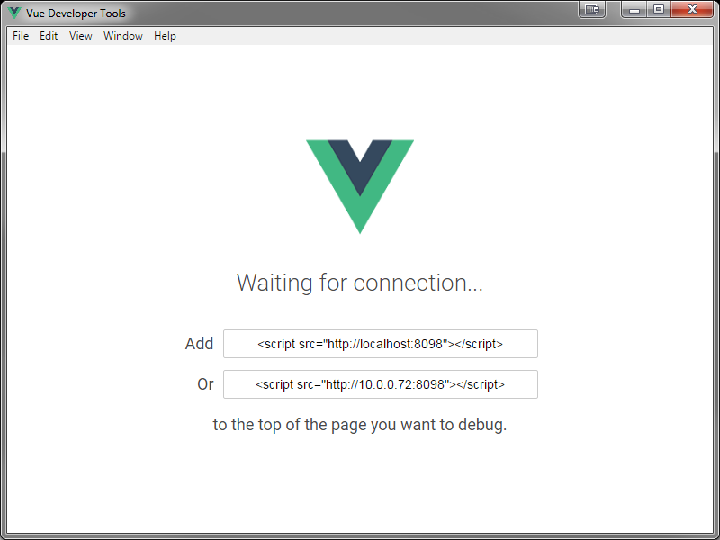

# WebpackStarter

## 01 Simple Template

This is the start of an ongoing repository for working with Webpack. It starts with a simple web app with an html template and 2 JS files to get the hang of working with Webpack, webpack-dev-server and the html-webpack-plugin.

Additional features are added onto the project and pushed as separate, labeled branches as time permits. Look at the branch listing in the Repository to identify which order features are added and what the last branch, which contains everything from all the previous branches, is.

Some references:

- <https://github.com/jantimon/html-webpack-plugin>
- <https://github.com/webpack/webpack-dev-server>

The index.js file loads all the required components for the app and Webpack figures out what to do with them.

## 02 Add CSS Branch

Adding simple CSS module to the app.

The files have been reorganized to separate things out a bit into *assets/styles* and *assets/scripts* and 2 style sheets have been added.

The index.js file has to "require" any assets such as style sheets. Webpack figures out what to do with these as it's bundling the files and generating the runtime modules into the *dist* folder.

Some references:

- <https://webpack.js.org/guides/asset-management>

Only problem I see so far is that the screen flashes with a white background before the custom styles take effect since they're loaded as part of the JS file which is loaded after the entire page is rendered.

## 03 Fix FOUC (Flash of Unstyled Content)

As noted earlier, when the app is loaded by the browser, the screen flashes with a white background before the custom styles take effect since they're loaded as part of the JS file which is loaded after the entire page is. This is known as the "Flash of Unstyled Content" and is related to how the styles are loaded as part of the JS modules which get loaded after the HTML content is.

There is a plugin, the "MiniCssExtractPlugin", which will extract the CSS and create css files which will then be loaded as part of the HTML file generated by the Webpack-dev-server.

- <https://blog.harveydelaney.com/fixing-fouc-in-your-webpack-build/>
- <https://hackernoon.com/a-tale-of-webpack-4-and-how-to-finally-configure-it-in-the-right-way-4e94c8e7e5c1>

## 04 Add SASS Branch

Adding simple SASS/SCSS functionality to the build.

See:

- https://webpack.js.org/plugins/mini-css-extract-plugin/

for how to configure webpack.config file to compile SCSS and merge into CSS file.

##05 Add Vue JS Branch

### *Why Import and not Require*

It's all about reducing the size of the JS Bundle via *tree shaking*

- https://insights.untapt.com/webpack-import-require-and-you-3fd7f5ea93c0

So use import and make sure to *module.export* appropriately in your source modules

### *Anonymous Component*

- https://forum.vuejs.org/t/anonymous-component-in-vue-devtools/8712/4

### *Debugging*

There are some very useful tools for debugging Vue.JS applications.

https://github.com/vuejs/vue-devtools

This app uses the "[electron][https://github.com/vuejs/vue-devtools/blob/master/shells/electron/README.md]" plugin (it seemed the simplest to use). But it takes a bit of work to use it.

The electron plugin must be installed (it's part of the package.json development modules), and added to the <head> tag of the index.html

	<!-- tag below needed for Electron Debugger -->
	<script src="http://localhost:8098"></script>
then it needs to be launched in a command line module of it's own:

```
C:> npm run dev
```

As the devtool starts up you might receive a firewall warning:



Simply click the "Allow access" button to allow the Electron plugin to communicate through the private network.

Then the Developer Tool app should display and state that it's waiting a connection (to the main app):



Then in a separate command line module the app needs to be built and run

```
C:> npm run clean
C:> npm run build
C:> npm run start
```

Notice that even though the `index.html` has content in it's `app` tag, none of that content is rendered (except as a potential "flash") because it is overwritten by the VueJS component. But that any content which is outside of the `app` tag IS rendered.

### *Nesting Components*

If you want to have multiple components in separate files, just create more `.VUE` files. And there can be only ONE "Root" component per template:

```<template>
// section1.vue
</template>
    <h2>Here is a nested line</h2>
</template>
```

If you want to nest components you need to create a single "root" component and stick the others inside that one component:

```<template>
// AppComponent.vue
</template>
    <div>	<!-- The Root Component
   		<h1>Hello from the AppComponent</h1>
		<section1></section1>
	</div>
</template>
```

And import the external component and export it as part of this component

```<script>
<script>
    import section1 from "./section1.vue";
	export default {
		name: "App",
		components: {
			section1
		}
	}
</script>
```


------

***Note:***

Additional features are added onto the project and pushed as separate, labeled branches as time permits. Look at the branch listing in the Repository to identify which order features are added and what the last branch, which contains everything from all the previous branches, is.

***Another Note - NTL:***

In this simple little project, I've also started using more `NPM scripts` in my `package.json` file. Because of this I've also installed the [NTL][https://www.npmjs.com/package/ntl] tool which is an interactive CLI menu to list and run any NPM tasks  in the package.json:

```
D:\_Code\Webpack\WebpackStarter>ntl
√  Npm Task List - v3.0.0
? Select a task to run: (Use arrow keys)
> clean
  build
  dev
  start
```

It's a simple install (I did it globally, but it can be done local to a project):

```
D:\_Code\npm install -g ntl
```

